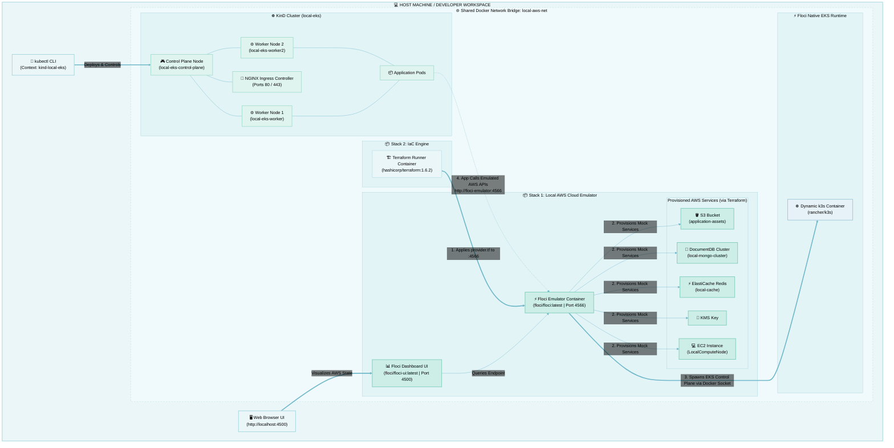

# 🚀 Local AWS Integration Blueprint



### 📂 Unified Folder Structure

Create a root folder named local-cloud-env with the following sub-directories and files:

```bash
local-cloud-env/
├── backend-infra/
│   └── docker-compose.yml       # Stack 1: Controls Floci Engine & Web UI
├── local-kubernetes/
│   └── kind-config.yaml         # High-Fidelity multi-node KinD definitions
├── terraform-provisioner/
│   ├── docker-compose.yml       # Stack 2: Automated IaC Execution Layer
│   ├── provider.tf              # AWS API Redirection Settings
│   └── main.tf                  # Declarative Cloud Architecture Blueprint
├── setup-prerequisites.sh       # Installs native host dependencies
├── setup.sh                     # Boots up infrastructure and KinD configuration
├── verify-tests.sh              # Runs isolated containerized AWS CLI checks
└── teardown.sh                  # Wipes the sandbox environment completely
```

This optimized configuration bundles the entire environment into two independent Docker Compose stacks and multiple scripts for automating environment setup and tests.

### 📄 backend-infra/docker-compose.yml (Stack 1)

This file defines the **Stack 1** like so:
1. Defines the core **Floci Cloud Engine**
2. Pre-configures a **shared bridge network** (local-aws-net) so that all future **KinD nodes** and **Terraform containers** can intercommunicate.
3. Defines the **AWS Web Console** via floci-ui


# 🕹️ How to execute and interact with the setup?

Your complete initialization workflow is now simplified into two consecutive script steps:

## Step 1. Bootstrap dependencies and pull up the cluster:

You need the following three core tools installed natively on your host machine:

1. **Docker Desktop** (or Docker Engine on Linux) — Must be running before starting.
2. **KinD CLI** — To orchestrate the multi-node Kubernetes container matrix.
3. **kubectl CLI** — The administrative console tool to interact with your cluster. [A, B, C, D] 

> Note: You DO NOT need to install the **AWS CLI** or **Terraform** on your host, as our setup isolates them cleanly **inside Stack 2's Docker container**. [E, F] 

```bash
# Step 1: Grant permissions to setup-prerequisites.sh, setup.sh and teardown.sh
chmod +x *.sh

# Step 2: Pull down your host prerequisites
bash ./setup-prerequisites.sh

# Step 3: Fire up your integrated local AWS and KinD environment
bash ./setup.sh

```

> Not all of these tools can be further dockerized. While you can run the aws-cli or kubectl inside containers, KinD (Kubernetes in Docker) strictly requires a native CLI installation on your host system. KinD functions by directly controlling your host's Docker daemon to spawn complex, multi-container system networks. Running KinD inside a container requires privileged, nested "Docker-in-Docker" configurations that break the external networking loop we created to let other developers connect to your machine.


## Step 2. Apply your infrastructure via Stack 2:

* **Stack 1** (`setup.sh`) only booted up the empty backend emulator engine and your KinD cluster base.
* **Stack 2** (your infrastructure blueprints) is what actually provisions those specific DocumentDB clusters, ElastiCache clusters, KMS keys, and EKS mappings inside the emulator.

Once the base system finishes initializing in Step #1 above, execute **Stack 2** to let the isolated Terraform engine provision your resources seamlessly:

```bash
cd terraform-provisioner && docker compose up && cd ..
```

The Terraform Provisioner remains completely isolated inside its own separate Docker Compose file. This allows you to orchestrate the core infrastructure platforms seamlessly, while triggering, modifying, or scaling your Terraform infrastructure declaratively at will, without ever restarting the underlying cloud or Kubernetes services.


This standalone container mounts your local .tf configuration workspace, hooks into the shared bridge network, applies your architecture, and immediately terminates upon success.

In case of errors:

```bash
cd terraform-provisioner
sudo rm -rf .terraform .terraform.lock.hcl terraform.tfstate terraform.tfstate.backup
cd ..
```

## Step 3. Verify the cluster

Run `./verify-cluster.sh` to verify the cluster setup.

```bash
./tests/test-cluster.sh

```

## Step 4. Open the Web UI Management Console:

Once you execute `./setup.sh` and deploy your infrastructure via Terraform, you can open floci dashboard like so:

1. Open your browser and navigate to `http://localhost:4500`.
2. You will be greeted by an admin control room showing your live application-assets S3 bucket, your local-mongo-cluster DocumentDB data layers, and your cryptographic KMS tracking keys.
3. You can visually view your active S3 buckets, select the file browser workspace, drag and drop documents into your bucket pipelines, and verify data flows interactively.

Even better—because it is bound to port 4500 on your machine, other developers on your network can access this identical console by hitting `http://<your-machine-ip>:4500`.

- [1] [https://github.com](https://github.com/floci-io/floci-ui)
- [2] [https://github.com](https://github.com/floci-io/floci/issues/1517)

## Step 5. Run the isolated API tests via Docker

Run `./tests/test-*.sh` at any time to instantly test various AWS services with zero clutter on your local machine.

```bash
./tests/test-services.sh
./tests/test-docdb.sh
./tests/test-rds.sh
```

## Step 6. Run AWS CLI Verification Tests inside Host

To verify each of the 6 simulated services, run these test commands from your host machine terminal.

#### 🔧 Prep your host environment parameters:

```bash
export AWS_ACCESS_KEY_ID=mock-key
export AWS_SECRET_ACCESS_KEY=mock-secret
export AWS_DEFAULT_REGION=us-east-1
export AWS_ENDPOINT_URL=http://localhost:4566
```

#### Test 1: Amazon MongoDB (DocumentDB)
Verify that the cluster control plane exists and matches the architecture defined in Terraform:

```bash
aws docdb describe-db-clusters --db-cluster-identifier local-mongo-cluster
```

#### Test 2: Amazon ElastiCache
Confirm that Floci has successfully provisioned a real underlying Redis engine tracking layer:

```bash
aws elasticache describe-cache-clusters --cache-cluster-id local-cache
```

#### Test 3: Amazon S3
Create a temporary dummy file and upload it directly into your local S3 object container:

```bash
echo "Testing local object store" > sample.txt
aws s3 cp sample.txt s3://application-assets/
aws s3 ls s3://application-assets/
```

#### Test 4: KMS Keys
List the encryption elements to confirm your cryptographic control plane keys are active:

```bash
aws kms list-keys
```

#### Test 5: Amazon EKS
Query the cluster metadata parameters to confirm EKS control plane mapping validation:

```bash
aws eks describe-cluster --name micro-eks
```

#### Test 6: Amazon EC2
Inspect your EC2 instances to verify that the proxy virtual machine container is online and tagged properly:

```bash
aws ec2 describe-instances --filters "Name=tag:Name,Values=LocalComputeNode"
```

## Step 7. Reset the workspace whenever necessary:

```bash
./teardown.sh

```

## Step 8. Resume environment after host reboot or shutdown:

When your machine shuts down, Docker containers and KinD nodes go offline. You **do not** need to re-run `setup-prerequisites.sh`[cite: 1]. 

Execute `restart.sh` to log target nodes, boot up existing KinD containers, reconnect network switches, and re-apply Stack 2 infrastructure cleanly:

```bash
# Make the restart script executable (if not already done)
chmod +x restart.sh

# Resume your complete local cloud setup
bash ./restart.sh
```